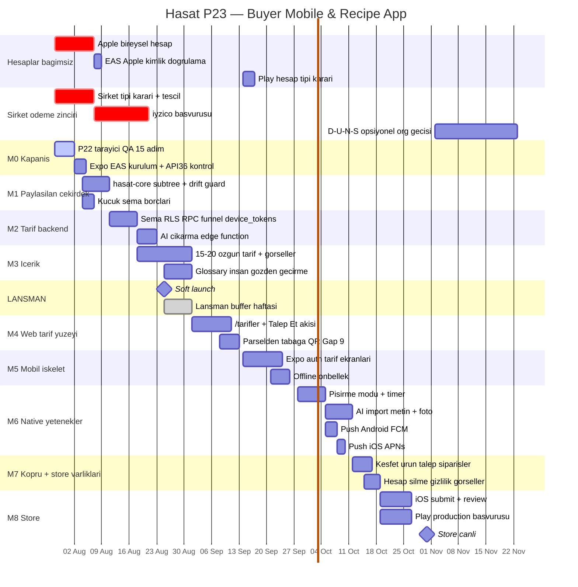

# P23 — Buyer Mobile & Recipe App · Görsel Yol Haritası

> Onaylandı: 2026-07-28 · Kural: **kapsam kesilmez, tarih ötelenir**
> Hedef: Store'da canlı ≈ **31 Ekim 2026**
> Detaylar: `Build/P23-Mobile.md` · `Build/Shared-Architecture.md` · `Build/Store-Compliance.md`

---

## 🔓 Esneklik ilkesi (Berkin kararı, 2026-07-28)

**Şirket kurulumu gecikirse, geriye yalnızca ödeme altyapısı ve store'a ekleme kalmalı — uygulama bunlara hazır olmalı.**

Bunu sağlayan dört karar:

1. **Apple Developer bireysel hesabı şimdi açılıyor** — D-U-N-S gerekmiyor, şirketten bağımsız. Apple kritik yoldan çıkıyor.
2. **Mobil v1'de checkout yok** — akış "Talep Et"te biter, ödeme web'de. Ödeme blokajı uygulamadan izole; Guideline 2.1 riski de kalkıyor.
3. **Push üçe bölündü** — `device_tokens` + dispatch (bağımsız) · Android FCM (bağımsız) · iOS APNs (yalnızca Apple hesabına bağlı, ~1 saatlik iş).
4. **Store varlıkları M8'den M7'ye çekildi** — gizlilik metni, hesap silme, ekran görüntüleri, review notları hiçbiri hesap gerektirmiyor. Hesap geldiğinde submit tek günlük iş.

**Sonuç:** Şirket gecikirse P23'te hiçbir iş durmaz. Bekleyen tek şey web tarafındaki gerçek ödeme (P17-A) ve fatura (P17-D).

---

## 🗓️ Şirket tescili — neden hâlâ acil

Apple kritik yoldan çıktı, ama şirket **ödeme zinciri** için hâlâ acil:

| Adım | Süre | Bitmesi gereken |
|---|---|---|
| 25 Ağustos soft launch'ta gerçek ödeme | — | 25 Ağustos |
| iyzico onboarding (şirket + vergi levhası ister) | 1–3 hafta | ~4 Ağustos'ta başvuru |
| Şirket tescili | 1–2 hafta | **~7 Ağustos'ta tamamlanmış** |

Ayrıca ileride organizasyon hesabına geçilecekse: tescil → D-U-N-S (1–4 hafta) → Apple/Play organizasyon doğrulaması (1–2 hafta).

### ⚠️ Şirket tipi kararı açık

Apple'ın resmî kuralı: organizasyon hesabı **tüzel kişilik** gerektiriyor; **şahıs şirketi bireysel kaydolmak zorunda** (satıcı adı = kişisel ad, "Hasat" değil).

| | Şahıs şirketi | Ltd. Şti. |
|---|---|---|
| Tescil hızı | Günler | 1–2 hafta |
| Maliyet / muhasebe | Düşük | Daha yüksek |
| Sorumluluk | Şahsi mal varlığı dahil | Sermaye ile sınırlı |
| App Store satıcı adı | Kişisel ad | **Hasat** |
| Play organizasyon muafiyeti | Belirsiz | Uygun |

Escrow ile başkasının parası tutulacağı için sorumluluk sınırı ayrıca değerlendirilmeli. **Mali müşavire sorulacak iki soru:** (1) Ltd. Şti. kuruluş süresi ve yıllık maliyet farkı? (2) Şahıs şirketi ile aracılık/escrow faaliyetinin sorumluluk riski?

> Bu bir hukuk/mali müşavirlik konusudur — karar öncesi profesyonel görüş alınmalı.

---

## 📊 Gantt

---

## 🎯 Kilometre taşları ve çıkış kriterleri

| # | Taş | Tarih (hedef) | Çıkış kriteri |
|---|---|---|---|
| **M0** | Açık işler + hesaplar | 28 Tem – 3 Ağu | **P22 tarayıcı QA (15 adım) kapandı**; Apple bireysel hesap başvurusu yapıldı; şirket tescili başladı; Expo/EAS hazır; API 36 desteği doğrulandı |
| **M1** | Paylaşılan çekirdek | 4 – 10 Ağu | `hasat-core` + subtree + drift guard kuruldu; **web'de sıfır regresyon**; küçük şema borçları kapandı |
| **M2** | Tarif backend'i (ekleyici) | 11 – 22 Ağu | Şema + RLS + RPC'ler gerçek SQL ve RLS simülasyonuyla doğrulandı; **3 crop testi** (mainstream + niş + yenilemez filtresi) |
| **M3** | İçerik | 18 Ağu – 1 Eyl | 15–20 özgün tarif; culinary meta seed; ~20 crop görseli; glossary insan gözden geçirmesi |
| — | **Soft launch** | **25 Ağu** | Lansman haftası **buffer** — yeni özellik yazılmaz |
| **M4** | Web tarif yüzeyi | 1 – 13 Eyl | `/tarifler` misafire açık ve SEO'lu; Talep Et çalışıyor; huni ölçümü veri üretiyor; **Gap #9 kapandı** |
| **M5** | Mobil iskelet | 14 – 27 Eyl | **Uçak modunda app açılıyor ve tarifler görünüyor** (Apple 4.2'nin asıl testi); Play hesap tipi kararı verildi |
| **M6** | Native yetenekler | 28 Eyl – 11 Eki | Pişirme modu + timer, AI import (metin + foto), push (iOS + Android) — gerçek cihazda doğrulandı |
| **M7** | Köprü + store varlıkları | 12 – 18 Eki | Keşfet → ürün → Talep Et → siparişlerim uçtan uca (**checkout yok**); hesap silme, gizlilik, ekran görüntüleri, review notları hazır |
| **M8** | Store submit | 19 – 31 Eki | iOS + Android canlı |
| **M9** | Sıraya alındı (silinmedi) | Kasım+ | YouTube/link import (hukuki kontrol) · yemek fotoğrafından tahmin · HoReCa porsiyon maliyeti · abonelik köprüsü · bildirim konsolidasyonu · organizasyon hesabına geçiş |

---

## 📏 Kurallar

**Öteleme kuralı.** Bir taş süresinde bitmezse kapsam **kesilmez**, sonraki taş sağa kayar. 25 Ağustos lansman haftası bilinçli olarak boştur.

**Lansman öncesi risk kuralı.** 25 Ağustos'tan önce yalnızca *ekleyici* (additive) işler. İki kez kırılmış bildirim hattına dokunan konsolidasyon refactor'ü M9'a bırakılmıştır.

**Faz kapanış ritüeli.**
1. Uygulama biter → bağımsız doğrulama (gerçek SQL / `get_diff` / gerçek cihaz — Lovable'ın metnine güvenilmez, kural #96)
2. Kural #104'e uygun, kullanıcı-akışı dilinde adım adım QA test case'i → Berkin uygular
3. Claude Code ilgili dokümanlara PR açar → Berkin merge eder
4. "commit ettim" → sonraki taş açılır

**Önceki taşın dokümanı merge edilmeden sonraki taş başlamaz.**
