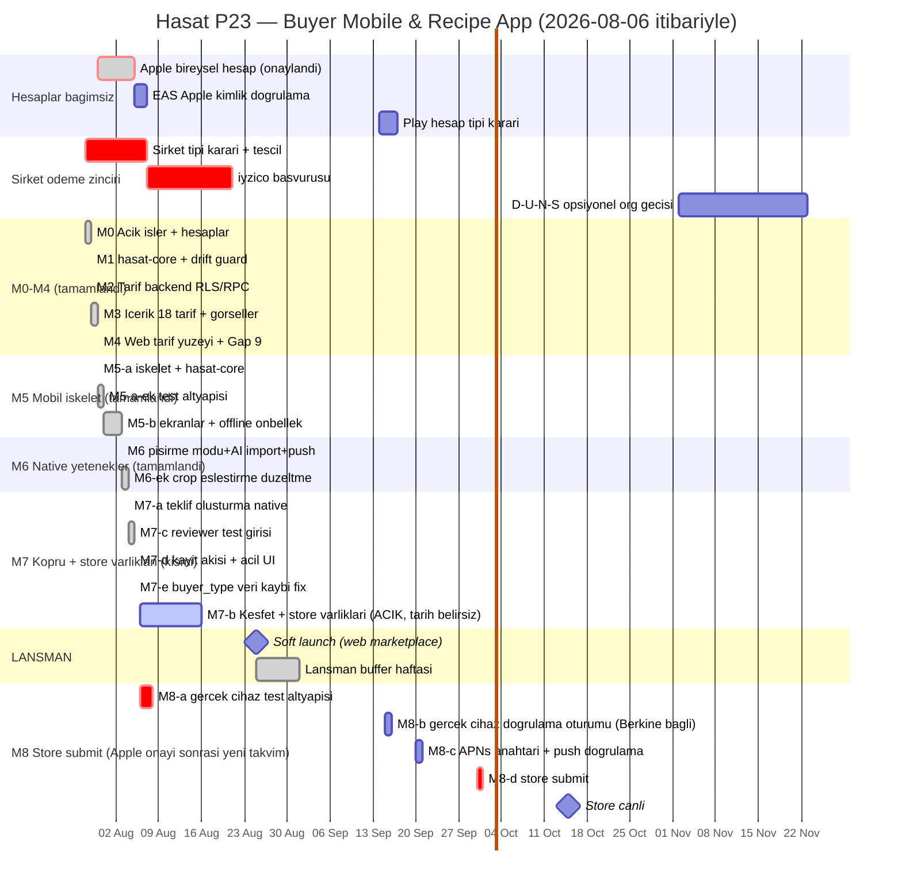

# P23 — Buyer Mobile & Recipe App · Görsel Yol Haritası

> Onaylandı: 2026-07-28 · Kural: **kapsam kesilmez, tarih ötelenir**
> Hedef: Store'da canlı ≈ **15 Ekim 2026** *(2026-08-06'da güncellendi — önceki
> hedef 31 Ekim'di; Apple bireysel hesabı planlanandan erken, 2026-08-05'te
> onaylandı, M8 öne çekildi. Gerekçe ve tam takvim: "⏱️ 2026-08-06 güncellemesi"
> bölümü aşağıda.)*
> Lansman kritik yolu: **web marketplace, 25 Ağustos 2026.** Mobil (M8) bu
> yolun üzerinde değil — bkz. `Build/Launch-Plan.md`.
> Detaylar: `Build/P23-Mobile.md` · `Build/Shared-Architecture.md` · `Build/Store-Compliance.md` · `Build/Launch-Plan.md`

---

## 🔓 Esneklik ilkesi (Berkin kararı, 2026-07-28)

**Şirket kurulumu gecikirse, geriye yalnızca ödeme altyapısı ve store'a ekleme kalmalı — uygulama bunlara hazır olmalı.**

Bunu sağlayan dört karar:

1. **Apple Developer bireysel hesabı şimdi açılıyor** — D-U-N-S gerekmiyor, şirketten bağımsız. Apple kritik yoldan çıkıyor.
2. **Mobil v1'de checkout yok** — akış "Talep Et"te biter, ödeme web'de. Ödeme blokajı uygulamadan izole; Guideline 2.1 riski de kalkıyor.
3. **Push üçe bölündü** — `device_tokens` + dispatch (bağımsız) · Android FCM (bağımsız) · iOS APNs (yalnızca Apple hesabına bağlı, ~1 saatlik iş).
4. **Store varlıkları M8'den M7'ye çekildi** — gizlilik metni, hesap silme, ekran görüntüleri, review notları hiçbiri hesap gerektirmiyor. Hesap geldiğinde submit tek günlük iş.

**Sonuç:** Şirket gecikirse P23'te hiçbir iş durmaz. Bekleyen tek şey web tarafındaki gerçek ödeme (P17-A) ve fatura (P17-D).

---

## 🗓️ Şirket tescili — neden hâlâ acil

Apple kritik yoldan çıktı, ama şirket **ödeme zinciri** için hâlâ acil:

| Adım | Süre | Bitmesi gereken |
|---|---|---|
| 25 Ağustos soft launch'ta gerçek ödeme | — | 25 Ağustos |
| iyzico onboarding (şirket + vergi levhası ister) | 1–3 hafta | ~4 Ağustos'ta başvuru |
| Şirket tescili | 1–2 hafta | **~7 Ağustos'ta tamamlanmış** |

Ayrıca ileride organizasyon hesabına geçilecekse: tescil → D-U-N-S (1–4 hafta) → Apple/Play organizasyon doğrulaması (1–2 hafta).

### ⚠️ Şirket tipi kararı açık

Apple'ın resmî kuralı: organizasyon hesabı **tüzel kişilik** gerektiriyor; **şahıs şirketi bireysel kaydolmak zorunda** (satıcı adı = kişisel ad, "Hasat" değil).

| | Şahıs şirketi | Ltd. Şti. |
|---|---|---|
| Tescil hızı | Günler | 1–2 hafta |
| Maliyet / muhasebe | Düşük | Daha yüksek |
| Sorumluluk | Şahsi mal varlığı dahil | Sermaye ile sınırlı |
| App Store satıcı adı | Kişisel ad | **Hasat** |
| Play organizasyon muafiyeti | Belirsiz | Uygun |

Escrow ile başkasının parası tutulacağı için sorumluluk sınırı ayrıca değerlendirilmeli. **Mali müşavire sorulacak iki soru:** (1) Ltd. Şti. kuruluş süresi ve yıllık maliyet farkı? (2) Şahıs şirketi ile aracılık/escrow faaliyetinin sorumluluk riski?

> Bu bir hukuk/mali müşavirlik konusudur — karar öncesi profesyonel görüş alınmalı.

---

## 📊 Gantt

> ⚠️ **Bu Gantt 2026-08-06'da gerçek duruma göre düzeltildi** — önceki hali
> M0-M7'yi hâlâ gelecek tarihli/planlanmış gösteriyordu, oysa hepsi build
> log'larda (`TODO.md`) çoktan tamamlanmıştı; asıl plandan 6-8 hafta önde
> koşulmuştu. Detay: aşağıdaki "⏱️ 2026-08-06 güncellemesi" bölümü.

**M7-b'nin tarihi (2026-08-06, +10g) bir yer tutucudur, onaylı değil** —
Berkin'den net bir tarih gelmedi; yalnızca M8-a'dan önce bitmesi gerektiği
varsayıldı (store submit için gizlilik metni/ekran görüntüleri/review notları
şart). Netleşince buraya ve `Build/Launch-Plan.md`'ye işlenmeli.

---

## ⏱️ 2026-08-06 güncellemesi — Gantt gerçek duruma göre düzeltildi

**Neden:** Bu Gantt'ın önceki hali M0-M7'yi hâlâ ileri tarihli gösteriyordu
(ör. M5 "14-27 Eylül", M7 "12-18 Ekim"), ama `TODO.md`'deki build log'ları
hepsinin çoktan bittiğini gösteriyor — **M0-M7 (M7-b hariç), planın 6-8 hafta
önünde, Temmuz sonu ile 5 Ağustos arasında tamamlandı.** Eski Gantt bu
turda `Build/Launch-Plan.md` hazırlanırken fark edildi (görev metninin M8
tarihleri — ~30 Eylül store submit, ~15 Ekim store canlı — bu Gantt'ın eski
M8 tarihleriyle, 19-31 Ekim, çelişiyordu); kök neden araştırılınca çelişkinin
kaynağının M8 değil, M5-M7'nin yanlış "gelecek" görünmesi olduğu ortaya çıktı.

**Yapılan düzeltme:**
1. M0, M1, M2, M3, M4, M5(-a/-a-ek/-b/-b-ek), M6(+ek) `done` olarak
   işaretlendi — tarihler `TODO.md`'deki ilgili build log başlıklarından
   alındı (ör. "P23-M5-a — TAMAMLANDI (2026-07-30)"). Bar başlangıç tarihleri
   **yaklaşık** (bir önceki taşın bitişine zincirlendi) — yalnızca **bitiş/
   tamamlanma tarihleri** build log'larından kesin.
2. M7, kısmi tamamlandı olarak işaretlendi: **M7-a/M7-c/M7-d/M7-e uygulandı**
   (2026-08-04 – 2026-08-05, gerçek SQL/RLS ile doğrulandı; bazıları
   simülatör/cihaz QA bekliyor). **M7-b (Keşfet + store varlıkları: gizlilik
   metni, ekran görüntüleri, review notları) hâlâ AÇIK** — `TODO.md`'de
   tamamlandığına dair kayıt yok. Bu, "M5/M6/M7 tamamlandı" varsayımının
   M7 için tam doğru olmadığı anlamına geliyor; kayda böyle geçirildi.
3. **Apple bireysel hesap** `done` işaretlendi — başvuru 2026-07-30/31,
   onay 2026-08-05 (bkz. görev bağlamı + `Build/Store-Compliance.md` →
   Bölüm 1; TODO.md bu onayı henüz kaydetmiyor, en güncel bilgi budur).
4. **M8, Apple onayına göre yeniden konumlandırıldı** — M8-a (gerçek cihaz
   test altyapısı, 6-8 Ağu) · M8-b (gerçek cihaz doğrulama oturumu, 15 Eyl,
   Berkin'e bağlı, lansman sonrası) · M8-c (APNs anahtarı + push doğrulama,
   20 Eyl) · M8-d (store submit, 30 Eyl) · Store canlı (~15 Eki). Tam
   döküm: `Build/Launch-Plan.md` → lansman sonrası milestone tablosu.
5. **Şirket tescili kritik yol çubuğu değişmedi** (`c1`, 2026-07-28 +10g =
   ~7 Ağustos hedefi) — bu doğruydu, dokunulmadı. Şirket tescili **henüz
   yapılmadı** (bu güncelleme tarihi itibariyle) ve iyzico (`c2`) ile P17-A
   escrow ona bağlı — kritik yol hâlâ burada, mobilde değil.
6. **Lansman haftası (25 Ağustos) bilinçli olarak boş** — web marketplace
   lansmanı kritik yol; mobil (M8) Ekim'e uzanıyor ama lansman yolunun
   üzerinde değil (bkz. `Build/P23-Mobile.md` → "Şirket gecikirse ne olur").

**Kapsam notu:** Görev metni yalnızca M8 tarihlerini vermişti; M0-M4'ün de
aynı şekilde bayat olduğu bu turda fark edildiği için tutarlılık adına
onlar da düzeltildi — aksi halde Gantt kendi içinde çelişik kalırdı (erken
taşlar geç taşlardan sonra bitmiş görünürdü).

---

## 🎯 Kilometre taşları ve çıkış kriterleri

| # | Taş | Tarih (hedef) | Çıkış kriteri |
|---|---|---|---|
| **M0** | Açık işler + hesaplar — ✅ **TAMAMLANDI (2026-07-29)** | 28 Tem – 3 Ağu | **P22 tarayıcı QA (15 adım) kapandı**; Apple bireysel hesap başvurusu yapıldı; şirket tescili başladı; Expo/EAS hazır; API 36 desteği doğrulandı |
| **M1** | Paylaşılan çekirdek — ✅ **TAMAMLANDI (2026-07-29)** | 4 – 10 Ağu | `hasat-core` + subtree + drift guard kuruldu; **web'de sıfır regresyon**; küçük şema borçları kapandı |
| **M2** | Tarif backend'i (ekleyici) — ✅ **TAMAMLANDI (2026-07-29)**, tarayıcı QA (S20-B) bekliyor | 11 – 22 Ağu | Şema + RLS + RPC'ler gerçek SQL ve RLS simülasyonuyla doğrulandı; **3 crop testi** (mainstream + niş + yenilemez filtresi) |
| **M3** | İçerik — ✅ **TAMAMLANDI (2026-07-30)**, tarayıcı QA (S21) bekliyor | 18 Ağu – 1 Eyl | 15–20 özgün tarif; culinary meta seed; ~20 crop görseli; glossary insan gözden geçirmesi (**glossary insan gözden geçirmesi hâlâ açık** — bkz. `Build/Launch-Plan.md` E6) |
| — | **Soft launch (web marketplace)** | **25 Ağu** | Lansman haftası **buffer** — yeni özellik yazılmaz; kritik yol burası, mobil (M8) değil |
| **M4** | Web tarif yüzeyi — ✅ **TAMAMLANDI (2026-07-30, a+b+c)** | 1 – 13 Eyl | `/tarifler` misafire açık ve SEO'lu; Talep Et çalışıyor; huni ölçümü veri üretiyor; **Gap #9 kapandı** |
| **M5** | Mobil iskelet — ✅ **TAMAMLANDI (2026-07-30 a, 07-31 a-ek, 08-03 b/b-ek)**, simülatör/cihaz QA (S26) bekliyor | 14 – 27 Eyl | **Uçak modunda app açılıyor ve tarifler görünüyor** (Apple 4.2'nin asıl testi, kod tarafı hazır — gerçek cihaz doğrulaması M8-b'de); Play hesap tipi kararı hâlâ M5'e ait, verilmedi |
| **M6** | Native yetenekler — ✅ **TAMAMLANDI (2026-08-03, 08-04 ek)**, simülatör/cihaz QA (S27) bekliyor | 28 Eyl – 11 Eki | Pişirme modu + timer, AI import (metin + foto), push token kaydı — kod tarafı hazır; **gerçek cihazda doğrulama M8-b/M8-c'de** |
| **M7** | Köprü + store varlıkları — 🟡 **KISMEN TAMAMLANDI**: M7-a/c/d/e uygulandı (2026-08-04 – 08-05); **M7-b (Keşfet + store varlıkları) AÇIK** | 12 – 18 Eki | Teklif oluşturma uçtan uca native (**checkout yok**) ✅; hesap silme ✅ (P26); Keşfet, gizlilik metni, ekran görüntüleri, review notları **hâlâ hazır değil** — M7-b |
| **M8** | Store submit — 🔵 **Apple hesabı onaylandı (2026-08-05), yeni takvim başladı** *(önceki hedef 19-31 Ekim'di, öne çekildi)* | M8-a 6-8 Ağu · M8-b 15 Eyl · M8-c 20 Eyl · M8-d 30 Eyl → Store canlı ~15 Eki | iOS + Android canlı — tam döküm: `Build/Launch-Plan.md` |
| **M9** | Sıraya alındı (silinmedi) | Kasım+ | YouTube/link import (hukuki kontrol) · yemek fotoğrafından tahmin · HoReCa porsiyon maliyeti · abonelik köprüsü · bildirim konsolidasyonu · organizasyon hesabına geçiş — ⚠️ bu satır bayat: web Defterim ve sipariş takibi web köprüsü de M9'a eklendi ama bu tabloya hiç yansımamıştı; **tam ve güncel konsolide liste:** `TODO.md` → "M9 — Lansman Sonrası" (17 madde, özet: `Build/Launch-Plan.md`) |

---

## 📏 Kurallar

**Öteleme kuralı.** Bir taş süresinde bitmezse kapsam **kesilmez**, sonraki taş sağa kayar. 25 Ağustos lansman haftası bilinçli olarak boştur.

**Lansman öncesi risk kuralı.** 25 Ağustos'tan önce yalnızca *ekleyici* (additive) işler. İki kez kırılmış bildirim hattına dokunan konsolidasyon refactor'ü M9'a bırakılmıştır. (Konsolide liste: `TODO.md` → "M9 — Lansman Sonrası" madde 6.)

**Faz kapanış ritüeli.**
1. Uygulama biter → bağımsız doğrulama (gerçek SQL / `get_diff` / gerçek cihaz — Lovable'ın metnine güvenilmez, kural #96)
2. Kural #104'e uygun, kullanıcı-akışı dilinde adım adım QA test case'i → Berkin uygular
3. Claude Code ilgili dokümanlara PR açar → Berkin merge eder
4. "commit ettim" → sonraki taş açılır

**Önceki taşın dokümanı merge edilmeden sonraki taş başlamaz.**
